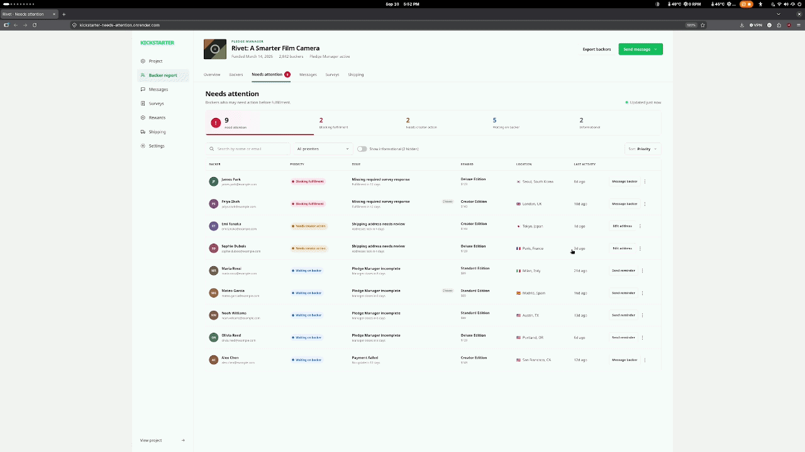

# Kickstarter “Needs Attention” queue



## Problem

Creators can inspect detailed backer state, but finding the operationally important exceptions may require knowing which filters and statuses to check. That makes it easy to miss a backer who is blocking fulfillment or spend time reviewing a state that requires no action.

## Prototype

This prototype adds a “Needs Attention” queue to a fictional Kickstarter Pledge Manager. Pure domain rules derive attention reasons from synthetic backer and project state, then prioritize each backer as blocking fulfillment, needing creator action, waiting on the backer, or informational.

The queue supports priority filtering, name/email search, an optional informational view, a selected-backer detail panel, and local snoozing. Each issue can recommend an ordered set of actions while keeping one concise next step in the table. Actions are simulated locally.

## Why this instead of another Backer Report filter?

A filter still asks a creator to know which status, deadline, and project-state combinations matter. This queue applies that operational interpretation first, then shows the small set of backers worth reviewing and explains each decision. The Backer Report remains the complete source of truth; “Needs Attention” is a focused workflow layered beside it.

## Product principle

Not every unusual state should generate an alert. An active Pledge Over Time installment, for example, is intentionally hidden from the default queue and clearly says that no creator action is required when shown. The queue should reduce cognitive load instead of creating another notification surface.

## Scope and caveat

All data and business rules are synthetic and illustrative. This is a focused product-engineering exploration, not an attempt to reproduce Kickstarter’s internal logic. A production implementation would use Kickstarter’s actual fulfillment requirements—for example, which survey fields a reward needs—rather than infer blocking state from a deadline alone. It has no backend, authentication, live Kickstarter integration, persistence, or real messaging/payment behavior.

## Architecture

The central logic lives in `src/domain/attention.ts` and is independent of React. It derives all applicable reasons for a backer, orders them by explicit priority rank and bounded urgency, builds the queue, and calculates summary counts. UI components receive that derived state and handle only presentation and local interactions.

## Run locally

```sh
npm install
npm run dev
```

Run the focused rules suite and production build with:

```sh
npm test -- --run
npm run build
```

## Deploy to Render

The repository includes a `render.yaml` Blueprint for a static site. In Render:

1. Grant Render's GitHub App access to the private `kickstarter-needs-attention` repository.
2. Choose **New → Blueprint** and connect this repository.
3. Review the `kickstarter-needs-attention` static site and apply the Blueprint.

The Blueprint installs locked dependencies, runs the test suite, builds the Vite app, and publishes `dist`. Deploys from `main` run automatically after each commit. Node is pinned in `.node-version` for repeatable builds.

## What I would measure

- percentage of surfaced issues acted on
- time from issue creation to resolution
- use of manual backer filters before and after adoption
- support contacts related to Pledge Manager or fulfillment-status confusion
- false-positive and dismissed-issue rate
